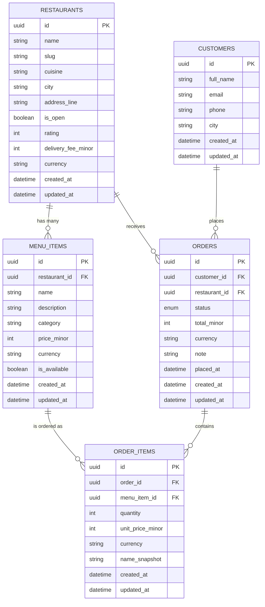

# food-market-api

A public REST API for a food delivery market, plus one small consumer page that calls the deployed API.
Next.js (App Router route handlers) + TypeScript + Prisma + PostgreSQL. The API is the product.

- Agent/working rules: [AGENTS.md](AGENTS.md)
- Design decisions and rejected alternatives: [DECISIONS.md](DECISIONS.md)
- Real errors hit while building: [BUILD_LOG.md](BUILD_LOG.md)

## Getting started

```bash
cp .env.example .env   # then fill in DATABASE_URL and NEXT_PUBLIC_API_BASE_URL yourself
npm install            # also runs `prisma generate`
npx prisma migrate deploy
npx prisma db seed
npm run dev
```

`NEXT_PUBLIC_API_BASE_URL` must be an absolute origin, because the page at `/consumer` calls the
API cross-origin from the browser. For local work use your machine's LAN address rather than
`localhost`, e.g. `http://192.168.0.56:3000`.

The seed is deterministic and idempotent: it generates the same rows, including the same UUIDs,
on every run, so running it twice changes nothing. Volumes and the fixed faker seed live in
[src/config.ts](src/config.ts).

If Prisma reports `P1001` against a database you can otherwise reach, your machine's DNS is
likely blocking the engine's own lookups; prefix the command with
`node scripts/with-resolved-db.mjs` and see entry 8 of [BUILD_LOG.md](BUILD_LOG.md).

### Database constraints

Six rules are enforced by `CHECK` constraints in the migration, because the Prisma schema language
cannot express them: `price_minor > 0`, `unit_price_minor > 0`, `quantity >= 1`,
`total_minor >= 0`, `delivery_fee_minor >= 0`, and `rating BETWEEN 0 AND 50`. Evidence that they
reject bad rows is in [evidence/](evidence/).

## The consumer page

One page, at `/consumer`. It lists restaurants with a city filter, a cuisine filter, a sort control
and a "Next page" button that follows `meta.nextCursor`, and it handles four states: loading, data,
empty (no matches) and error — including a 429, which it shows with the retry time from the
`Retry-After` header.

It calls the API from the browser over the **absolute** URL in `NEXT_PUBLIC_API_BASE_URL`, never a
relative path and never localhost, so it exercises the published API exactly as any third-party
client would, CORS included. The variable is read at build time, so it must be set before
`next build`, not only at runtime.

The root page `/` is a one-line pointer to this README and to `/consumer`.

## Deployment (Railway)

Deployed as a long-running Node server, not serverless.

| Setting | Value |
| --- | --- |
| Build | `npm run build` → `prisma generate && next build` |
| Start | `npm start` → `next start` (Next binds the `PORT` Railway provides) |
| Node | `>=22.0.0`, declared in `package.json` `engines` |

Environment variables to set on the service:

| Variable | Value |
| --- | --- |
| `DATABASE_URL` | The Postgres connection string. Inside Railway use the private address; from a laptop use the public `*.proxy.rlwy.net` one. |
| `NEXT_PUBLIC_API_BASE_URL` | The deployed origin, e.g. `https://your-service.up.railway.app`. Needed **at build time**. |

### Migrating and seeding

The database is migrated and seeded already. To do it again, from a machine with `.env` filled in:

```bash
npx prisma migrate deploy   # apply all migrations, including the CHECK constraints
npx prisma db seed          # deterministic and idempotent: safe to re-run
```

Equivalent npm scripts exist: `npm run db:migrate` and `npm run db:seed`.

If Prisma reports `P1001` against a database you can otherwise reach, your machine is blocking the
engine's DNS lookups. Prefix either command with the helper:

```bash
node scripts/with-resolved-db.mjs npx prisma migrate deploy
```

See entry 8 of [BUILD_LOG.md](BUILD_LOG.md) for why.

> **Note.** The Railway database is both the production and the development database. That choice,
> and its trade-off, is recorded as decision 11 in [DECISIONS.md](DECISIONS.md).

### CORS

Every `/api/v1` response allows any origin for GET, POST, PATCH and DELETE, and OPTIONS preflight is
answered from the shared wrapper. `Location` and `Retry-After` are exposed to browser clients. The
headers are present on error responses too, so a browser can read a 400, a 429 or a 500 rather than
seeing an opaque network failure. Decision 10 in [DECISIONS.md](DECISIONS.md) explains why a
wildcard is safe here and what must change if authentication is ever added.

## Resource design

This section is the design contract for the five resources. No Prisma schema and no endpoints exist yet.

Conventions that apply to every resource below:

- `id` is a generated **UUID** (v4), never a sequential integer.
- `createdAt` and `updatedAt` are `DateTime` (UTC), set by the database.
- Money is an **integer in minor units** (kobo) in a `*Minor` column, with a `currency` column (ISO 4217, default `NGN`) beside it. Never a decimal or float.
- `restaurants.rating` follows the same integer discipline: it is stored in **tenths of a star**, so a rating of **45 means 4.5 stars**. Divide by 10 to display.
- Table names are `snake_case` plural; JSON field names are `camelCase`.

### restaurants

| Field | Type | Required | Notes |
| --- | --- | --- | --- |
| `id` | UUID | yes | Primary key, generated. |
| `name` | String(120) | yes | Display name. **Sortable.** |
| `slug` | String(140) | yes | Unique, URL-safe, derived from `name`. |
| `cuisine` | String(60) | yes | e.g. `nigerian`, `chinese`, `fast-food`. **Filterable.** |
| `city` | String(80) | yes | e.g. `Lagos`, `Abuja`. **Filterable.** |
| `addressLine` | String(200) | yes | Street address within `city`. |
| `isOpen` | Boolean | yes | Default `true`. **Filterable.** |
| `rating` | Int | yes | Average rating in **tenths of a star**, `0`-`50` — `45` means 4.5 stars. An integer so it sorts exactly and avoids float drift. Default `0`. A `CHECK` constraint keeps it in range. **Sortable.** |
| `deliveryFeeMinor` | Int | yes | Delivery fee in kobo. **Filterable** (range) and **sortable**. |
| `currency` | String(3) | yes | ISO 4217, default `NGN`. Pairs with `deliveryFeeMinor`. |
| `createdAt` | DateTime | yes | **Sortable** (default sort). |
| `updatedAt` | DateTime | yes | Auto-updated. |

Filter fields: `cuisine`, `city`, `isOpen`, `deliveryFeeMinor` (min/max). Sort fields: `name`, `rating`, `deliveryFeeMinor`, `createdAt`.

### menu_items

| Field | Type | Required | Notes |
| --- | --- | --- | --- |
| `id` | UUID | yes | Primary key, generated. |
| `restaurantId` | UUID | yes | FK to `restaurants.id`. **Filterable.** |
| `name` | String(120) | yes | **Sortable.** |
| `description` | String(500) | no | Nullable. |
| `category` | String(60) | yes | e.g. `main`, `side`, `drink`, `dessert`. **Filterable.** |
| `priceMinor` | Int | yes | Price in kobo, must be `> 0`. **Filterable** (range) and **sortable**. |
| `currency` | String(3) | yes | ISO 4217, default `NGN`. Pairs with `priceMinor`. |
| `isAvailable` | Boolean | yes | Default `true`. **Filterable.** |
| `createdAt` | DateTime | yes | **Sortable** (default sort). |
| `updatedAt` | DateTime | yes | Auto-updated. |

Filter fields: `restaurantId`, `category`, `isAvailable`, `priceMinor` (min/max). Sort fields: `name`, `priceMinor`, `createdAt`.

### customers

| Field | Type | Required | Notes |
| --- | --- | --- | --- |
| `id` | UUID | yes | Primary key, generated. |
| `fullName` | String(120) | yes | **Sortable.** |
| `email` | String(160) | yes | Unique, stored lowercased. **Filterable** (exact match). |
| `phone` | String(20) | yes | E.164-style digits. |
| `city` | String(80) | yes | **Filterable.** |
| `createdAt` | DateTime | yes | **Sortable** (default sort). |
| `updatedAt` | DateTime | yes | Auto-updated. |

Filter fields: `city`, `email`. Sort fields: `fullName`, `createdAt`.

### orders

| Field | Type | Required | Notes |
| --- | --- | --- | --- |
| `id` | UUID | yes | Primary key, generated. |
| `customerId` | UUID | yes | FK to `customers.id`. **Filterable.** |
| `restaurantId` | UUID | yes | FK to `restaurants.id`. **Filterable.** |
| `status` | Enum `OrderStatus` | yes | Default `pending`. **Filterable.** |
| `totalMinor` | Int | yes | Sum over the order items of `quantity * unitPriceMinor`, in kobo. Stored at write time, not recomputed per request. **Sortable.** |
| `currency` | String(3) | yes | ISO 4217, default `NGN`. Pairs with `totalMinor`. |
| `note` | String(500) | no | Customer instructions. Nullable. |
| `placedAt` | DateTime | yes | When the order was placed. **Filterable** (from/to) and **sortable** (default sort). |
| `createdAt` | DateTime | yes | Row creation time. |
| `updatedAt` | DateTime | yes | Auto-updated. |

Filter fields: `status`, `customerId`, `restaurantId`, `placedAt` (from/to). Sort fields: `placedAt`, `totalMinor`, `createdAt`.

### order_items

| Field | Type | Required | Notes |
| --- | --- | --- | --- |
| `id` | UUID | yes | Primary key, generated. |
| `orderId` | UUID | yes | FK to `orders.id`. Deleted with its order (cascade). **Filterable.** |
| `menuItemId` | UUID | yes | FK to `menu_items.id`. Delete restricted while referenced. **Filterable.** |
| `quantity` | Int | yes | Must be `>= 1`. **Sortable.** |
| `unitPriceMinor` | Int | yes | Unit price **at the time of ordering**, in kobo. Copied from the menu item on create and never re-read afterwards. **Sortable.** |
| `currency` | String(3) | yes | ISO 4217, default `NGN`. Pairs with `unitPriceMinor`. |
| `nameSnapshot` | String(120) | yes | Menu item name at the time of ordering, so renaming a dish does not rewrite order history. |
| `createdAt` | DateTime | yes | **Sortable** (default sort). |
| `updatedAt` | DateTime | yes | Auto-updated. |

The line total is `quantity * unitPriceMinor`, computed on read rather than stored.
Unique constraint on (`orderId`, `menuItemId`): one line per menu item per order, with `quantity` carrying the count.

### Relationships

| From | To | Cardinality | FK column |
| --- | --- | --- | --- |
| `restaurants` | `menu_items` | one-to-many | `menu_items.restaurant_id` |
| `customers` | `orders` | one-to-many | `orders.customer_id` |
| `restaurants` | `orders` | one-to-many | `orders.restaurant_id` |
| `orders` | `order_items` | one-to-many | `order_items.order_id` |
| `menu_items` | `order_items` | one-to-many | `order_items.menu_item_id` |

Read the other way round: a menu item belongs to one restaurant; an order belongs to one customer and one restaurant; an order item belongs to one order and one menu item.

### ER diagram



### Order statuses

`orders.status` is an enum with exactly these five values:

| Status | Meaning |
| --- | --- |
| `pending` | Created, not yet accepted by the restaurant. Default on create. |
| `confirmed` | Accepted by the restaurant. |
| `preparing` | Being cooked. |
| `delivered` | Terminal success state. |
| `cancelled` | Terminal failure state. |

### Endpoints at a glance

| Method | Path | Purpose |
| --- | --- | --- |
| GET | `/api/v1/restaurants` | List restaurants, with cursor pagination, filtering and sorting. |
| GET | `/api/v1/restaurants/:id` | Fetch one restaurant. |
| GET | `/api/v1/restaurants/:id/menu` | List one restaurant's menu items (nested resource). |
| GET | `/api/v1/menu-items` | List menu items across all restaurants. |
| GET | `/api/v1/menu-items/:id` | Fetch one menu item. |
| GET | `/api/v1/customers` | List customers. |
| GET | `/api/v1/customers/:id` | Fetch one customer. |
| GET | `/api/v1/orders` | List orders. |
| GET | `/api/v1/orders/:id` | Fetch one order. |
| GET | `/api/v1/orders/:id/items` | List one order's order items (nested resource). |
| POST | `/api/v1/orders` | Create an order together with its items, snapshotting prices from the menu. |
| PATCH | `/api/v1/orders/:id` | Update an order, primarily `status` and `note`. |
| DELETE | `/api/v1/orders/:id` | Delete an order and its order items. |
| GET | `/api/v1/order-items` | List order items. |
| GET | `/api/v1/order-items/:id` | Fetch one order item. |

All 15 are implemented. Full parameters, curl examples and example responses are in the API reference below.
Success responses are `{ "data": ..., "meta": ... }`; errors are `{ "error": { "code", "message", "details"? } }` with an honest status code.

## API reference

Set `BASE_URL` to your deployment before running any example. It is a placeholder, replaced after
deploy:

```bash
export BASE_URL=http://localhost:3000     # replace with the deployed origin
```

### Conventions

Every endpoint lives under `/api/v1/`. Resources are plural, kebab-case nouns; the HTTP method is
the verb.

**Success** is always `{ "data": ..., "meta": ... }`. On a list, `meta` is:

| Field | Type | Meaning |
| --- | --- | --- |
| `total` | integer | Rows matching the filters, ignoring pagination. |
| `limit` | integer | The limit actually applied, after clamping. |
| `nextCursor` | string or null | Pass as `?cursor=` for the next page. `null` on the last page. |
| `hasMore` | boolean | Whether another page exists. |

**Errors** are always `{ "error": { "code", "message", "details"? } }` with a real status code —
never a 200 with an error inside.

| Status | `code` | When |
| --- | --- | --- |
| 400 | `BAD_REQUEST` | Bad query parameter, unknown parameter, malformed id, invalid cursor. |
| 404 | `NOT_FOUND` | Well-formed id, no such row. |
| 409 | `CONFLICT` | Valid request that conflicts with current state (a refused status move). |
| 422 | `VALIDATION_FAILED` | Body parsed but failed validation. `details` names every field. |
| 429 | `RATE_LIMITED` | Rate limit exceeded. Sent with a `Retry-After` header, in seconds. |
| 500 | `INTERNAL_ERROR` | Unexpected failure. Deliberately says nothing about the cause. |

**Shared query parameters** (every list endpoint):

| Parameter | Type | Default | Notes |
| --- | --- | --- | --- |
| `limit` | integer | `20` | Max `100`. Above the max is **clamped**, not rejected. Below 1 or non-numeric is a 400. |
| `cursor` | string | — | Opaque. Only valid for the `sort` and `order` it was issued under; otherwise 400. |
| `sort` | enum | per resource | Must be in that resource's allowed list, else 400. |
| `order` | `asc` \| `desc` | `desc` | Anything else is a 400. |

An unknown query parameter is a 400, so a typo cannot silently return unfiltered data.

Money fields are integers in **kobo** with a `currency` beside them; `restaurants.rating` is in
tenths of a star (`45` = 4.5).

---

### GET /api/v1/restaurants

List restaurants.

| Parameter | Type | Default |
| --- | --- | --- |
| `cuisine` | string | — |
| `city` | string | — |
| `isOpen` | `true` \| `false` | — |
| `minDeliveryFee` | integer (kobo) | — |
| `maxDeliveryFee` | integer (kobo) | — |
| `sort` | `name` \| `rating` \| `deliveryFeeMinor` \| `createdAt` | `createdAt` |

```bash
curl "$BASE_URL/api/v1/restaurants?city=Lagos&isOpen=true&sort=rating&order=desc&limit=2"
```

```json
{
  "data": [
    {
      "id": "cf046486-4a95-439b-8dfd-65de855b5fb7",
      "name": "Balistreri LLC Spot",
      "slug": "balistreri-llc-spot-17",
      "cuisine": "grill",
      "city": "Lagos",
      "addressLine": "905 Jalyn Trail",
      "isOpen": true,
      "rating": 50,
      "deliveryFeeMinor": 180000,
      "currency": "NGN",
      "createdAt": "2025-06-11T09:12:44.102Z",
      "updatedAt": "2025-06-11T09:12:44.102Z"
    }
  ],
  "meta": { "total": 31, "limit": 2, "nextCursor": "eyJ2IjoxLCJzIjoicmF0aW5nIi4uLn0", "hasMore": true }
}
```

### GET /api/v1/restaurants/:id

Fetch one restaurant. Malformed id → 400; unknown id → 404.

```bash
curl "$BASE_URL/api/v1/restaurants/cf046486-4a95-439b-8dfd-65de855b5fb7"
```

```json
{
  "data": {
    "id": "cf046486-4a95-439b-8dfd-65de855b5fb7",
    "name": "Balistreri LLC Spot",
    "cuisine": "grill",
    "city": "Lagos",
    "isOpen": true,
    "rating": 50,
    "deliveryFeeMinor": 180000,
    "currency": "NGN"
  },
  "meta": {}
}
```

### GET /api/v1/restaurants/:id/menu

One restaurant's menu items. The restaurant comes from the path, so `restaurantId` is not accepted
here. Unknown restaurant → 404 (not an empty list).

| Parameter | Type | Default |
| --- | --- | --- |
| `category` | string | — |
| `isAvailable` | `true` \| `false` | — |
| `minPrice`, `maxPrice` | integer (kobo) | — |
| `sort` | `name` \| `priceMinor` \| `createdAt` | `createdAt` |

```bash
curl "$BASE_URL/api/v1/restaurants/cf046486-4a95-439b-8dfd-65de855b5fb7/menu?isAvailable=true&sort=priceMinor&order=asc&limit=2"
```

```json
{
  "data": [
    {
      "id": "3c843f16-9c15-4c30-8a7b-c7886735b291",
      "restaurantId": "cf046486-4a95-439b-8dfd-65de855b5fb7",
      "name": "Orange-infused Lamb Roast 3",
      "description": "Slow roasted with citrus and rosemary.",
      "category": "main",
      "priceMinor": 814300,
      "currency": "NGN",
      "isAvailable": true,
      "createdAt": "2025-05-02T11:04:01.880Z",
      "updatedAt": "2025-05-02T11:04:01.880Z"
    }
  ],
  "meta": {
    "total": 9,
    "limit": 2,
    "nextCursor": "eyJ2IjoxLCJzIjoicHJpY2VNaW5vciIsLi4ufQ",
    "hasMore": true,
    "restaurantId": "cf046486-4a95-439b-8dfd-65de855b5fb7"
  }
}
```

### GET /api/v1/menu-items

Menu items across all restaurants. Same filters as the nested route, plus `restaurantId`.

| Parameter | Type | Default |
| --- | --- | --- |
| `restaurantId` | UUID | — |
| `category` | string | — |
| `isAvailable` | `true` \| `false` | — |
| `minPrice`, `maxPrice` | integer (kobo) | — |
| `sort` | `name` \| `priceMinor` \| `createdAt` | `createdAt` |

```bash
curl "$BASE_URL/api/v1/menu-items?category=main&isAvailable=true&minPrice=100000&sort=priceMinor&order=asc&limit=3"
```

```json
{
  "data": [
    { "id": "69d513b2-80cc-4b29-b8d2-73efd5952257", "name": "Som Tam 1", "category": "main", "priceMinor": 109700, "currency": "NGN", "isAvailable": true }
  ],
  "meta": { "total": 279, "limit": 3, "nextCursor": "eyJ2IjoxLCJzIjoicHJpY2VNaW5vciIsIm8iOiJhc2MiLCJrIjoiMTA5NzAwIi4uLn0", "hasMore": true }
}
```

### GET /api/v1/menu-items/:id

```bash
curl "$BASE_URL/api/v1/menu-items/3c843f16-9c15-4c30-8a7b-c7886735b291"
```

```json
{
  "data": {
    "id": "3c843f16-9c15-4c30-8a7b-c7886735b291",
    "restaurantId": "cf046486-4a95-439b-8dfd-65de855b5fb7",
    "name": "Orange-infused Lamb Roast 3",
    "category": "main",
    "priceMinor": 814300,
    "currency": "NGN",
    "isAvailable": true
  },
  "meta": {}
}
```

### GET /api/v1/customers

| Parameter | Type | Default |
| --- | --- | --- |
| `city` | string | — |
| `email` | email | — |
| `sort` | `fullName` \| `createdAt` | `createdAt` |

```bash
curl "$BASE_URL/api/v1/customers?city=Abuja&sort=fullName&order=asc&limit=2"
```

```json
{
  "data": [
    {
      "id": "a0b3dca1-5f9e-4a0e-9a1f-2b7d6f1c8e44",
      "fullName": "Adaeze Okonkwo",
      "email": "adaeze-okonkwo.12@example.com",
      "phone": "+2347012345678",
      "city": "Abuja",
      "createdAt": "2025-02-18T07:41:12.004Z",
      "updatedAt": "2025-02-18T07:41:12.004Z"
    }
  ],
  "meta": { "total": 44, "limit": 2, "nextCursor": "eyJ2IjoxLCJzIjoiZnVsbE5hbWUiLi4ufQ", "hasMore": true }
}
```

### GET /api/v1/customers/:id

```bash
curl "$BASE_URL/api/v1/customers/a0b3dca1-5f9e-4a0e-9a1f-2b7d6f1c8e44"
```

```json
{
  "data": { "id": "a0b3dca1-5f9e-4a0e-9a1f-2b7d6f1c8e44", "fullName": "Adaeze Okonkwo", "email": "adaeze-okonkwo.12@example.com", "city": "Abuja" },
  "meta": {}
}
```

### GET /api/v1/orders

| Parameter | Type | Default |
| --- | --- | --- |
| `status` | `pending` \| `confirmed` \| `preparing` \| `delivered` \| `cancelled` | — |
| `customerId` | UUID | — |
| `restaurantId` | UUID | — |
| `placedFrom`, `placedTo` | ISO 8601 date | — |
| `sort` | `placedAt` \| `totalMinor` \| `createdAt` | `placedAt` |

```bash
curl "$BASE_URL/api/v1/orders?status=delivered&placedFrom=2025-12-01&sort=totalMinor&order=desc&limit=2"
```

```json
{
  "data": [
    {
      "id": "97a1f037-9c1c-4065-bbf0-7d0038e92c89",
      "customerId": "a0b3dca1-5f9e-4a0e-9a1f-2b7d6f1c8e44",
      "restaurantId": "cf046486-4a95-439b-8dfd-65de855b5fb7",
      "status": "delivered",
      "totalMinor": 3029300,
      "currency": "NGN",
      "note": null,
      "placedAt": "2025-12-14T18:22:07.511Z",
      "createdAt": "2025-12-14T18:22:07.511Z",
      "updatedAt": "2025-12-14T18:22:07.511Z"
    }
  ],
  "meta": { "total": 37, "limit": 2, "nextCursor": "eyJ2IjoxLCJzIjoidG90YWxNaW5vciIsLi4ufQ", "hasMore": true }
}
```

### GET /api/v1/orders/:id

Includes the order's items.

```bash
curl "$BASE_URL/api/v1/orders/97a1f037-9c1c-4065-bbf0-7d0038e92c89"
```

```json
{
  "data": {
    "id": "97a1f037-9c1c-4065-bbf0-7d0038e92c89",
    "status": "pending",
    "totalMinor": 3029300,
    "currency": "NGN",
    "items": [
      { "id": "0f1e...", "menuItemId": "3c843f16-9c15-4c30-8a7b-c7886735b291", "quantity": 1, "unitPriceMinor": 814300, "nameSnapshot": "Orange-infused Lamb Roast 3", "currency": "NGN" },
      { "id": "7a22...", "menuItemId": "b61c...", "quantity": 2, "unitPriceMinor": 1107500, "nameSnapshot": "Loquats-infused Quail 7", "currency": "NGN" }
    ]
  },
  "meta": {}
}
```

### GET /api/v1/orders/:id/items

One order's items. The order comes from the path. Unknown order → 404.

| Parameter | Type | Default |
| --- | --- | --- |
| `menuItemId` | UUID | — |
| `minQuantity` | integer | — |
| `sort` | `quantity` \| `unitPriceMinor` \| `createdAt` | `createdAt` |

```bash
curl "$BASE_URL/api/v1/orders/97a1f037-9c1c-4065-bbf0-7d0038e92c89/items?sort=quantity&order=desc"
```

```json
{
  "data": [
    { "id": "7a22...", "orderId": "97a1f037-9c1c-4065-bbf0-7d0038e92c89", "menuItemId": "b61c...", "quantity": 2, "unitPriceMinor": 1107500, "nameSnapshot": "Loquats-infused Quail 7", "currency": "NGN" }
  ],
  "meta": { "total": 2, "limit": 20, "nextCursor": null, "hasMore": false, "orderId": "97a1f037-9c1c-4065-bbf0-7d0038e92c89" }
}
```

### POST /api/v1/orders

Creates an order and its items in one transaction. `unitPriceMinor` and `nameSnapshot` are copied
from the menu item at this moment and never re-read; `totalMinor` is computed server-side. Returns
**201** with a `Location` header. The order starts as `pending`.

Body:

| Field | Type | Required |
| --- | --- | --- |
| `customerId` | UUID | yes |
| `restaurantId` | UUID | yes |
| `note` | string, ≤500 chars | no |
| `items` | array, at least one | yes |
| `items[].menuItemId` | UUID | yes |
| `items[].quantity` | integer ≥ 1 | yes |

Returns **422** naming each field for: an unknown customer, restaurant or menu item; a menu item
belonging to another restaurant; an unavailable menu item; the same menu item listed twice; an
empty `items` array; any unexpected field.

```bash
curl -X POST "$BASE_URL/api/v1/orders" \
  -H 'content-type: application/json' \
  -d '{
        "customerId": "a0b3dca1-5f9e-4a0e-9a1f-2b7d6f1c8e44",
        "restaurantId": "cf046486-4a95-439b-8dfd-65de855b5fb7",
        "note": "Extra pepper, no onions.",
        "items": [
          { "menuItemId": "3c843f16-9c15-4c30-8a7b-c7886735b291", "quantity": 1 },
          { "menuItemId": "b61cf0a2-7d44-4a0b-9d2e-55b0a1e3c7f9", "quantity": 2 }
        ]
      }'
```

```
HTTP/1.1 201 Created
Location: /api/v1/orders/97a1f037-9c1c-4065-bbf0-7d0038e92c89
```

```json
{
  "data": {
    "id": "97a1f037-9c1c-4065-bbf0-7d0038e92c89",
    "status": "pending",
    "totalMinor": 3029300,
    "currency": "NGN",
    "note": "Extra pepper, no onions.",
    "items": [
      { "menuItemId": "3c843f16-9c15-4c30-8a7b-c7886735b291", "quantity": 1, "unitPriceMinor": 814300, "nameSnapshot": "Orange-infused Lamb Roast 3" },
      { "menuItemId": "b61cf0a2-7d44-4a0b-9d2e-55b0a1e3c7f9", "quantity": 2, "unitPriceMinor": 1107500, "nameSnapshot": "Loquats-infused Quail 7" }
    ]
  },
  "meta": {}
}
```

A 422, for comparison:

```json
{
  "error": {
    "code": "VALIDATION_FAILED",
    "message": "The request body failed validation.",
    "details": [
      { "field": "items[0].menuItemId", "message": "Menu item 778564f9-1191-4f22-adca-fee2ada48d93 belongs to a different restaurant." }
    ]
  }
}
```

### PATCH /api/v1/orders/:id

Accepts **only** `status` and `note`; at least one must be present. Any other field is a 422.

| Field | Type | Required |
| --- | --- | --- |
| `status` | one of the five statuses | no |
| `note` | string ≤500 chars, or `null` to clear | no |

Allowed status moves — anything else is a **409**:

| From | To |
| --- | --- |
| `pending` | `confirmed`, `cancelled` |
| `confirmed` | `preparing`, `cancelled` |
| `preparing` | `delivered`, `cancelled` |
| `delivered` | nothing (terminal) |
| `cancelled` | nothing (terminal) |

```bash
curl -X PATCH "$BASE_URL/api/v1/orders/97a1f037-9c1c-4065-bbf0-7d0038e92c89" \
  -H 'content-type: application/json' \
  -d '{ "status": "confirmed" }'
```

```json
{ "data": { "id": "97a1f037-9c1c-4065-bbf0-7d0038e92c89", "status": "confirmed", "totalMinor": 3029300, "items": [] }, "meta": {} }
```

A refused move:

```json
{
  "error": {
    "code": "CONFLICT",
    "message": "Cannot change status from pending to delivered. Allowed from pending: confirmed, cancelled.",
    "details": { "from": "pending", "to": "delivered", "allowed": ["confirmed", "cancelled"] }
  }
}
```

### DELETE /api/v1/orders/:id

Deletes the order and, by cascade, its order items. **204** with no body, or 404 if it does not
exist.

```bash
curl -i -X DELETE "$BASE_URL/api/v1/orders/97a1f037-9c1c-4065-bbf0-7d0038e92c89"
```

```
HTTP/1.1 204 No Content
```

### GET /api/v1/order-items

Order items across all orders.

| Parameter | Type | Default |
| --- | --- | --- |
| `orderId` | UUID | — |
| `menuItemId` | UUID | — |
| `minQuantity` | integer | — |
| `sort` | `quantity` \| `unitPriceMinor` \| `createdAt` | `createdAt` |

```bash
curl "$BASE_URL/api/v1/order-items?minQuantity=3&sort=unitPriceMinor&order=desc&limit=2"
```

```json
{
  "data": [
    { "id": "7a22...", "orderId": "97a1f037-9c1c-4065-bbf0-7d0038e92c89", "menuItemId": "b61c...", "quantity": 3, "unitPriceMinor": 1480000, "nameSnapshot": "Loquats-infused Quail 7", "currency": "NGN" }
  ],
  "meta": { "total": 486, "limit": 2, "nextCursor": "eyJ2IjoxLCJzIjoidW5pdFByaWNlTWlub3IiLi4ufQ", "hasMore": true }
}
```

### GET /api/v1/order-items/:id

```bash
curl "$BASE_URL/api/v1/order-items/7a22b4c1-1d9f-4a3e-8c77-2b0d9e5f1a66"
```

```json
{
  "data": { "id": "7a22b4c1-1d9f-4a3e-8c77-2b0d9e5f1a66", "orderId": "97a1f037-9c1c-4065-bbf0-7d0038e92c89", "quantity": 2, "unitPriceMinor": 1107500, "nameSnapshot": "Loquats-infused Quail 7", "currency": "NGN" },
  "meta": {}
}
```

### Rate limiting

100 requests per 60 seconds per client address, both configurable in
[src/config.ts](src/config.ts). Over the limit:

```
HTTP/1.1 429 Too Many Requests
Retry-After: 37
```

```json
{ "error": { "code": "RATE_LIMITED", "message": "Rate limit of 100 requests per 60s exceeded." } }
```

---

## Design decisions

Full reasoning, including the alternatives rejected, is in [DECISIONS.md](DECISIONS.md). The four
choices that shape the API surface:

### Why these five resources

They are the smallest set that can express a food delivery market without inventing structure.
Restaurants and menu items model the catalogue a customer browses; customers and orders model the
transaction; order items are the join between an order and the menu, and they have to exist
separately because a line carries its own `quantity` and its own price. Collapsing order items into
a JSON column on `orders` would make "how many times was this dish ordered" unanswerable in SQL.
Anything further — riders, payments, reviews, addresses — is a different brief.

### Why generated identifiers

Every `id` is a UUID generated on insert, never a sequential integer. On a public API, sequential
ids leak the size of each table and let anyone enumerate other people's orders by walking
`/orders/1`, `/orders/2`. UUIDs also let a client generate an id before the row exists, which is
what makes a retried create safe to make idempotent later. The costs are real but small here: a
wider key, and index inserts that land randomly rather than at the end.

### Why cursor pagination, and when offset is better

Every list endpoint paginates by cursor. `OFFSET` makes Postgres count and discard every skipped
row, so deep pages get progressively slower, and — worse for a feed — rows inserted while a client
is paging shift the window, so the client sees some records twice and misses others. A cursor
anchored on `(sort value, id)` is a seek: page 500 costs what page 1 costs, and the window is
stable while the client reads it.

Offset would be the better choice if the client needed numbered pages — "jump to page 7", or a
table with a page-number control — or if someone had to be able to construct a page link by hand.
Offset is also simpler to debug, because the parameter is human-readable. Our consumer page is a
feed, so the trade favours cursors; a dashboard with a paginated table would be a reason to revisit
this.

### The envelope, and why

Success is `{ "data": ..., "meta": ... }`; failure is
`{ "error": { "code", "message", "details"? } }`. Three reasons for the wrapper rather than
returning a bare array or object:

1. **There is somewhere to put pagination.** `total`, `limit`, `nextCursor` and `hasMore` belong
   with the response, not in headers a client has to remember to read.
2. **The shape never changes.** A client parses one success shape and one error shape, and adding a
   field to `meta` breaks nothing. A bare top-level array has no room to grow at all.
3. **Errors are machine-readable and honest.** `code` is stable enough to branch on, `message` is
   for a human reading logs, and `details` names the offending fields on a 422. The status code
   always matches: never a 200 carrying an error, and a 500 deliberately reveals nothing about its
   cause.

The cost is one level of nesting on every read — `response.data` rather than `response` — which is
a small price for not having to version the envelope later.
