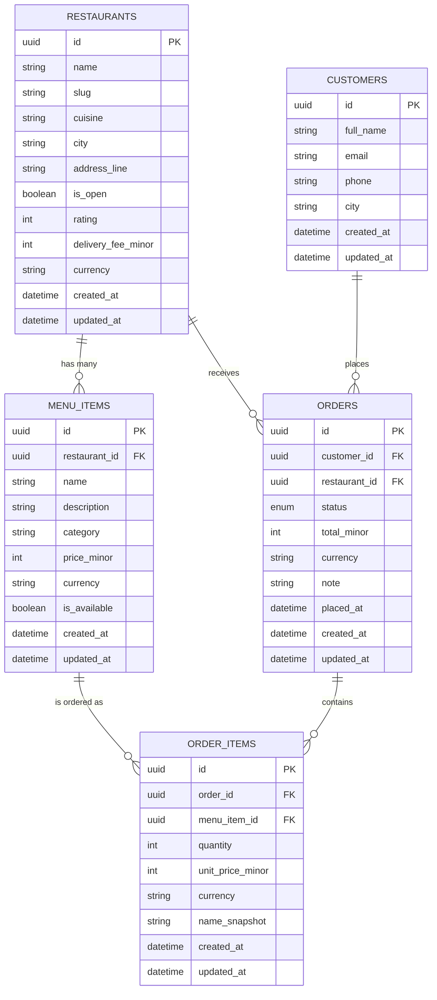

# food-market-api

A public REST API for a food delivery market, plus one small consumer page that calls the deployed API.
Next.js (App Router route handlers) + TypeScript + Prisma + PostgreSQL. The API is the product.

- Agent/working rules: [AGENTS.md](AGENTS.md)
- Design decisions and rejected alternatives: [DECISIONS.md](DECISIONS.md)
- Real errors hit while building: [BUILD_LOG.md](BUILD_LOG.md)

## Getting started

```bash
cp .env.example .env   # then fill in DATABASE_URL yourself
npm install            # also runs `prisma generate`
npx prisma migrate deploy
npx prisma db seed
npm run dev
```

The seed is deterministic and idempotent: it generates the same rows, including the same UUIDs,
on every run, so running it twice changes nothing. Volumes and the fixed faker seed live in
[src/config.ts](src/config.ts).

If Prisma reports `P1001` against a database you can otherwise reach, your machine's DNS is
likely blocking the engine's own lookups; prefix the command with
`node scripts/with-resolved-db.mjs` and see entry 8 of [BUILD_LOG.md](BUILD_LOG.md).

### Database constraints

Six rules are enforced by `CHECK` constraints in the migration, because the Prisma schema language
cannot express them: `price_minor > 0`, `unit_price_minor > 0`, `quantity >= 1`,
`total_minor >= 0`, `delivery_fee_minor >= 0`, and `rating BETWEEN 0 AND 50`. Evidence that they
reject bad rows is in [evidence/](evidence/).

## Resource design

This section is the design contract for the five resources. No Prisma schema and no endpoints exist yet.

Conventions that apply to every resource below:

- `id` is a generated **UUID** (v4), never a sequential integer.
- `createdAt` and `updatedAt` are `DateTime` (UTC), set by the database.
- Money is an **integer in minor units** (kobo) in a `*Minor` column, with a `currency` column (ISO 4217, default `NGN`) beside it. Never a decimal or float.
- `restaurants.rating` follows the same integer discipline: it is stored in **tenths of a star**, so a rating of **45 means 4.5 stars**. Divide by 10 to display.
- Table names are `snake_case` plural; JSON field names are `camelCase`.

### restaurants

| Field | Type | Required | Notes |
| --- | --- | --- | --- |
| `id` | UUID | yes | Primary key, generated. |
| `name` | String(120) | yes | Display name. **Sortable.** |
| `slug` | String(140) | yes | Unique, URL-safe, derived from `name`. |
| `cuisine` | String(60) | yes | e.g. `nigerian`, `chinese`, `fast-food`. **Filterable.** |
| `city` | String(80) | yes | e.g. `Lagos`, `Abuja`. **Filterable.** |
| `addressLine` | String(200) | yes | Street address within `city`. |
| `isOpen` | Boolean | yes | Default `true`. **Filterable.** |
| `rating` | Int | yes | Average rating in **tenths of a star**, `0`-`50` — `45` means 4.5 stars. An integer so it sorts exactly and avoids float drift. Default `0`. A `CHECK` constraint keeps it in range. **Sortable.** |
| `deliveryFeeMinor` | Int | yes | Delivery fee in kobo. **Filterable** (range) and **sortable**. |
| `currency` | String(3) | yes | ISO 4217, default `NGN`. Pairs with `deliveryFeeMinor`. |
| `createdAt` | DateTime | yes | **Sortable** (default sort). |
| `updatedAt` | DateTime | yes | Auto-updated. |

Filter fields: `cuisine`, `city`, `isOpen`, `deliveryFeeMinor` (min/max). Sort fields: `name`, `rating`, `deliveryFeeMinor`, `createdAt`.

### menu_items

| Field | Type | Required | Notes |
| --- | --- | --- | --- |
| `id` | UUID | yes | Primary key, generated. |
| `restaurantId` | UUID | yes | FK to `restaurants.id`. **Filterable.** |
| `name` | String(120) | yes | **Sortable.** |
| `description` | String(500) | no | Nullable. |
| `category` | String(60) | yes | e.g. `main`, `side`, `drink`, `dessert`. **Filterable.** |
| `priceMinor` | Int | yes | Price in kobo, must be `> 0`. **Filterable** (range) and **sortable**. |
| `currency` | String(3) | yes | ISO 4217, default `NGN`. Pairs with `priceMinor`. |
| `isAvailable` | Boolean | yes | Default `true`. **Filterable.** |
| `createdAt` | DateTime | yes | **Sortable** (default sort). |
| `updatedAt` | DateTime | yes | Auto-updated. |

Filter fields: `restaurantId`, `category`, `isAvailable`, `priceMinor` (min/max). Sort fields: `name`, `priceMinor`, `createdAt`.

### customers

| Field | Type | Required | Notes |
| --- | --- | --- | --- |
| `id` | UUID | yes | Primary key, generated. |
| `fullName` | String(120) | yes | **Sortable.** |
| `email` | String(160) | yes | Unique, stored lowercased. **Filterable** (exact match). |
| `phone` | String(20) | yes | E.164-style digits. |
| `city` | String(80) | yes | **Filterable.** |
| `createdAt` | DateTime | yes | **Sortable** (default sort). |
| `updatedAt` | DateTime | yes | Auto-updated. |

Filter fields: `city`, `email`. Sort fields: `fullName`, `createdAt`.

### orders

| Field | Type | Required | Notes |
| --- | --- | --- | --- |
| `id` | UUID | yes | Primary key, generated. |
| `customerId` | UUID | yes | FK to `customers.id`. **Filterable.** |
| `restaurantId` | UUID | yes | FK to `restaurants.id`. **Filterable.** |
| `status` | Enum `OrderStatus` | yes | Default `pending`. **Filterable.** |
| `totalMinor` | Int | yes | Sum over the order items of `quantity * unitPriceMinor`, in kobo. Stored at write time, not recomputed per request. **Sortable.** |
| `currency` | String(3) | yes | ISO 4217, default `NGN`. Pairs with `totalMinor`. |
| `note` | String(500) | no | Customer instructions. Nullable. |
| `placedAt` | DateTime | yes | When the order was placed. **Filterable** (from/to) and **sortable** (default sort). |
| `createdAt` | DateTime | yes | Row creation time. |
| `updatedAt` | DateTime | yes | Auto-updated. |

Filter fields: `status`, `customerId`, `restaurantId`, `placedAt` (from/to). Sort fields: `placedAt`, `totalMinor`, `createdAt`.

### order_items

| Field | Type | Required | Notes |
| --- | --- | --- | --- |
| `id` | UUID | yes | Primary key, generated. |
| `orderId` | UUID | yes | FK to `orders.id`. Deleted with its order (cascade). **Filterable.** |
| `menuItemId` | UUID | yes | FK to `menu_items.id`. Delete restricted while referenced. **Filterable.** |
| `quantity` | Int | yes | Must be `>= 1`. **Sortable.** |
| `unitPriceMinor` | Int | yes | Unit price **at the time of ordering**, in kobo. Copied from the menu item on create and never re-read afterwards. **Sortable.** |
| `currency` | String(3) | yes | ISO 4217, default `NGN`. Pairs with `unitPriceMinor`. |
| `nameSnapshot` | String(120) | yes | Menu item name at the time of ordering, so renaming a dish does not rewrite order history. |
| `createdAt` | DateTime | yes | **Sortable** (default sort). |
| `updatedAt` | DateTime | yes | Auto-updated. |

The line total is `quantity * unitPriceMinor`, computed on read rather than stored.
Unique constraint on (`orderId`, `menuItemId`): one line per menu item per order, with `quantity` carrying the count.

### Relationships

| From | To | Cardinality | FK column |
| --- | --- | --- | --- |
| `restaurants` | `menu_items` | one-to-many | `menu_items.restaurant_id` |
| `customers` | `orders` | one-to-many | `orders.customer_id` |
| `restaurants` | `orders` | one-to-many | `orders.restaurant_id` |
| `orders` | `order_items` | one-to-many | `order_items.order_id` |
| `menu_items` | `order_items` | one-to-many | `order_items.menu_item_id` |

Read the other way round: a menu item belongs to one restaurant; an order belongs to one customer and one restaurant; an order item belongs to one order and one menu item.

### ER diagram



### Order statuses

`orders.status` is an enum with exactly these five values:

| Status | Meaning |
| --- | --- |
| `pending` | Created, not yet accepted by the restaurant. Default on create. |
| `confirmed` | Accepted by the restaurant. |
| `preparing` | Being cooked. |
| `delivered` | Terminal success state. |
| `cancelled` | Terminal failure state. |

### Planned endpoints

| Method | Path | Purpose |
| --- | --- | --- |
| GET | `/api/v1/restaurants` | List restaurants, with cursor pagination, filtering and sorting. |
| GET | `/api/v1/restaurants/:id` | Fetch one restaurant. |
| GET | `/api/v1/restaurants/:id/menu` | List one restaurant's menu items (nested resource). |
| GET | `/api/v1/menu-items` | List menu items across all restaurants. |
| GET | `/api/v1/menu-items/:id` | Fetch one menu item. |
| GET | `/api/v1/customers` | List customers. |
| GET | `/api/v1/customers/:id` | Fetch one customer. |
| GET | `/api/v1/orders` | List orders. |
| GET | `/api/v1/orders/:id` | Fetch one order. |
| GET | `/api/v1/orders/:id/items` | List one order's order items (nested resource). |
| POST | `/api/v1/orders` | Create an order together with its items, snapshotting prices from the menu. |
| PATCH | `/api/v1/orders/:id` | Update an order, primarily `status` and `note`. |
| DELETE | `/api/v1/orders/:id` | Delete an order and its order items. |
| GET | `/api/v1/order-items` | List order items. |
| GET | `/api/v1/order-items/:id` | Fetch one order item. |

Every list endpoint accepts `?limit=` (default 20, max 100, values above the max clamped), `?cursor=`, `?sort=` and `?order=`, plus its own filters.
Success responses are `{ "data": ..., "meta": ... }`; errors are `{ "error": { "code", "message", "details"? } }` with an honest status code.
